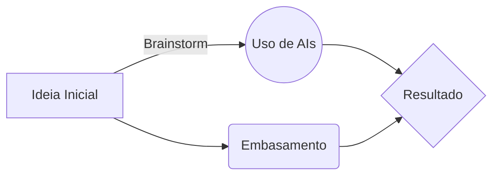

# Estúdio Bigorna Inflável

## 📒 Descrição

Imagine uma plataforma revolucionária que transforma a maneira como as aulas são criadas e apresentadas. Nosso projeto, Estúdio Bigorna Inflável, é uma solução completa para educadores que desejam engajar seus alunos de forma dinâmica e interativa.

#### Biblioteca Vasta e Personalizável de Recursos Educacionais

Nossa plataforma oferece uma vasta biblioteca de recursos prontos, abrangendo desde slides e apresentações até jogos educativos. Todos os recursos são 100% personalizáveis, permitindo que os educadores adaptem o conteúdo exatamente às necessidades de seus alunos e ao currículo específico que estão seguindo.

#### Ferramentas Avançadas para Criação e Edição

Para facilitar ainda mais o processo de desenvolvimento das aulas, Estúdio Bigorna Inflável inclui um editor de vídeo simplificado que permite a criação e a edição de vídeos educativos de forma intuitiva. Com essa ferramenta, os educadores podem:

-   **Mesclar Vídeos**: Combine diferentes clipes para criar um conteúdo coeso e envolvente.
-   **Inserir Efeitos Visuais e Sonoros**: Adicione elementos visuais e sonoros que capturam a atenção dos alunos e enriquecem a experiência de aprendizagem.
-   **Adicionar Legendas**: Insira legendas para tornar os vídeos mais acessíveis e fáceis de entender.

#### Jogos Educativos Interativos

Uma das funcionalidades mais emocionantes de Estúdio Bigorna Inflável é a capacidade de criar jogos educativos. Esses jogos não apenas tornam o aprendizado mais divertido, mas também incentivam a participação ativa e o engajamento dos alunos.

#### Interface Amigável e Intuitiva

A nossa plataforma foi projetada com uma interface amigável e intuitiva, facilitando o uso para educadores de todos os níveis de habilidade tecnológica. Desde o planejamento da aula até a apresentação final, cada passo foi simplificado para economizar tempo e esforço.

#### Exemplos de Uso

-   **Professores**: Criem aulas dinâmicas e interativas que capturam a atenção dos alunos e promovem uma aprendizagem mais profunda.
-   **Escolas e Instituições de Ensino**: Implementem uma ferramenta versátil que pode ser usada em várias disciplinas e níveis de ensino.
-   **Educadores Independentes**: Desenvolvam cursos online que se destacam pela qualidade e interatividade.

### Transformando a Educação

Com Estúdio Bigorna Inflável, estamos transformando a educação ao fornecer ferramentas que capacitam os educadores a criar aulas dinâmicas e envolventes. Acreditamos que, ao tornar o processo de ensino mais interativo e personalizado, podemos melhorar significativamente a qualidade da educação e o desempenho dos alunos.

## 🤖 Tecnologias Utilizadas

Para criar uma plataforma robusta, eficiente e moderna, incorporamos uma série de tecnologias de ponta. Abaixo, detalhamos as principais ferramentas e linguagens de programação que utilizamos para desenvolver [Nome da Plataforma]:

#### API de Integração com ChatGPT

Nossa plataforma se integra com a API do ChatGPT para fornecer suporte imediato aos usuários. Com essa integração, os educadores podem obter esclarecimentos de dúvidas e dicas diretamente dentro da plataforma, facilitando a criação de conteúdos e a resolução de problemas técnicos.

#### Bria para Geração de Imagens Customizadas

Utilizamos a Bria.ai para a criação de imagens customizadas que enriquecem os recursos visuais das aulas. Com a Bria, os educadores podem gerar gráficos, ilustrações e outros elementos visuais personalizados para tornar o conteúdo mais atraente e adequado às necessidades específicas de suas aulas.

#### Boomy para Criação de Músicas Educativas

Para proporcionar uma experiência auditiva única, integramos a Boomy.ai na plataforma. A Boomy é utilizada para a criação de músicas educativas e trilhas sonoras de fundo, que ajudam a manter os alunos engajados e a criar um ambiente de aprendizado mais envolvente.

#### Linguagens de Programação Utilizadas

Nossa plataforma foi construída utilizando uma combinação de linguagens de programação modernas e eficientes, escolhidas por suas respectivas vantagens e capacidades:

-   **Golang (Go)**: Utilizamos Go para desenvolver partes do backend devido à sua performance e capacidade de lidar com concorrência, o que é essencial para uma plataforma que precisa processar múltiplas requisições simultaneamente.
    
-   **Rust**: Rust foi escolhido por sua segurança e performance, especialmente em áreas críticas onde a gestão de memória é crucial. Isso nos ajuda a garantir que a plataforma seja rápida e confiável.
    
-   **Typescript**: No desenvolvimento do frontend, Typescript oferece tipagem estática que ajuda a reduzir erros durante a programação e a melhorar a manutenção do código. Isso é essencial para criar uma interface de usuário robusta e responsiva.
    
-   **Cobol**: Embora seja uma linguagem legado, utilizamos Cobol para comunicar-se eficientemente com outras infraestruturas tradicionais ainda em uso em algumas instituições educacionais.
    
-   **Kotlin**: Kotlin foi escolhido para o desenvolvimento de aplicativos móveis devido à sua interoperabilidade com Java e suas modernas características de linguagem, proporcionando uma experiência de desenvolvimento mais produtiva e segura.

### Sinergia das Tecnologias

A combinação dessas tecnologias nos permite oferecer uma plataforma que não só é poderosa e flexível, mas também segura e eficiente. Nossa infraestrutura técnica foi cuidadosamente planejada para suportar um ambiente de aprendizado dinâmico e interativo, garantindo que educadores e alunos tenham acesso às melhores ferramentas disponíveis.

----------

Com essa abordagem tecnológica avançada, estamos comprometidos em oferecer uma plataforma de ponta que atenda às necessidades contemporâneas da educação e forneça um ambiente de ensino inovador e eficaz.

## 🧐 Processo de Criação Colaborativo e Global

O desenvolvimento da nossa plataforma foi uma jornada colaborativa e global, enriquecida pela contribuição de profissionais de ensino de diversas partes do mundo. Consultamos educadores experientes e inovadores em países como Austrália, Brasil, Cingapura, Estados Unidos, Finlândia, Ilhas Maurício, Israel, Japão, Nova Zelândia, Portugal.

#### Insights Internacionais

Essas consultas proporcionaram uma compreensão profunda das diversas abordagens educacionais, necessidades dos alunos e desafios enfrentados pelos educadores em diferentes contextos culturais e geográficos. Com base nesses insights internacionais, pudemos desenvolver uma plataforma verdadeiramente global, que atende às demandas e expectativas de educadores em todo o mundo.

## 🚀 Resultados Promissores em Pouco Tempo

Apesar de termos pouco mais de um ano de experiência, os resultados obtidos com nossa plataforma têm sido extraordinários. Atualmente, contamos com a participação ativa de 87 comunidades educacionais que adotaram nossa ferramenta como parte integrante de seus programas de ensino.

#### Adoção Crescente

Testemunhamos uma rápida aceitação e adoção da nossa plataforma em comunidades educacionais ao redor do mundo. Educadores, alunos e pais estão descobrindo os benefícios de uma abordagem de ensino mais dinâmica e personalizada.

#### Impacto Positivo na Educação Domiciliar

Um dos resultados mais significativos é a resposta positiva dos pais em relação ao desempenho acadêmico de seus filhos. Tanto é assim que muitos optaram pelo homeschooling, reconhecendo que a educação de qualidade pode ser alcançada em casa com a ajuda da nossa plataforma. Essa mudança reflete a crença de que a educação verdadeira começa em casa, com pais ativos no processo de aprendizagem de seus filhos.

### Depoimentos de Sucesso

"Estou impressionado com o progresso que meu filho tem feito desde que começamos a usar a plataforma. Ele está mais engajado e motivado do que nunca!" - Sadan Nayad (Pai de Aluno)

"Nossa comunidade escolar inteira se beneficiou enormemente com a implementação da plataforma. Os resultados falam por si mesmos!" - Kazuya Gushiken (Educador de Ensino Infantil)

### Olhando para o Futuro

À medida que continuamos a crescer e evoluir, estamos comprometidos em expandir nosso alcance e impacto na educação global. Com uma base sólida de resultados positivos e o apoio contínuo das comunidades educacionais, estamos confiantes de que estamos no caminho certo para transformar a forma como o mundo aprende.

## 💭 Reflexão (Opcional)

Sendo bem franco, me diverti muito criando este desafio, segui um processo como apresentado abaixo:

Agora, seguir meus estudos, para trazer meus projetos reais a tona.
PS.: Sadan Nayad e Kazuya Gushiken são psedônimos meus, ninguém ficou ofendido com o escrito neste projeto.
